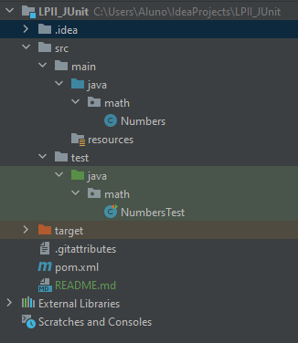
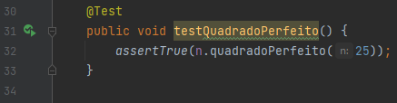
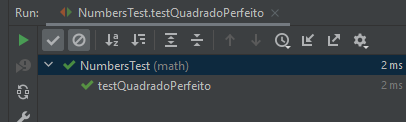
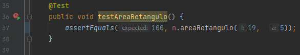
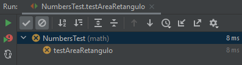
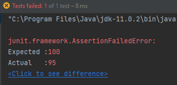

# LPII_JUnit

Esse projeto é referente a uma prática da disciplina de Laboratorio do Programação II do curso técnico em Informática no CEFET-MG. O objetivo aqui é testar o framework JUnit, que auxilia no processo de testes de um projeto.

O projeto é simples, é constituído de uma classe denominada Numbers, a qual apresenta alguns métodos: quadradoPerfeito, areaRetangulo e divisivel.

A estrutura dos arquivos é a seguinte:

No diretório main temos a estrutura principal do projeto e no diretório test temos as classes de teste, nesse caso, a classe de teste.

A classe NumberTest possui as configurações de uma classe de teste, onde a estrutura principal é aquela que de fato testa os métodos da classe Numbers. Podemos observar uma delas a seguir:

A partícula assertTrue serve para verificar se o retorno do parâmetro é verdadeiro, e a resposta para esse caso é positiva:

Outro exemplo de teste cujo resultado seria negativo é o seguinte:

A ideia dessa atividade é basicamente essa, o projeto está disponível nesse repositório para consultas mais detalhadas.

### Referências:

https://youtu.be/V2I-XnesC3A

https://youtu.be/Bld3644bIAo

https://youtu.be/Q2zBRTgKXHo
